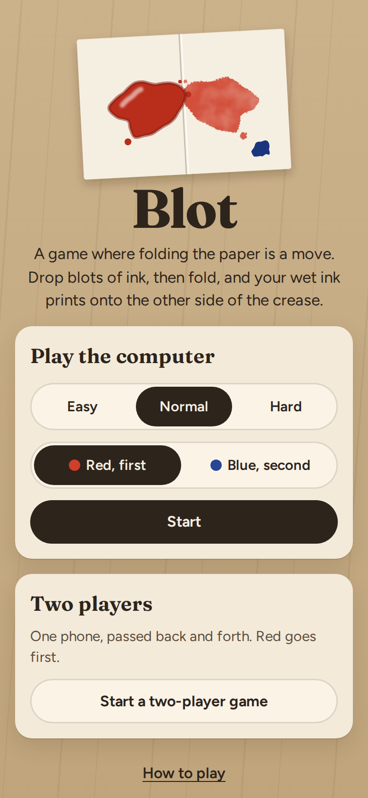
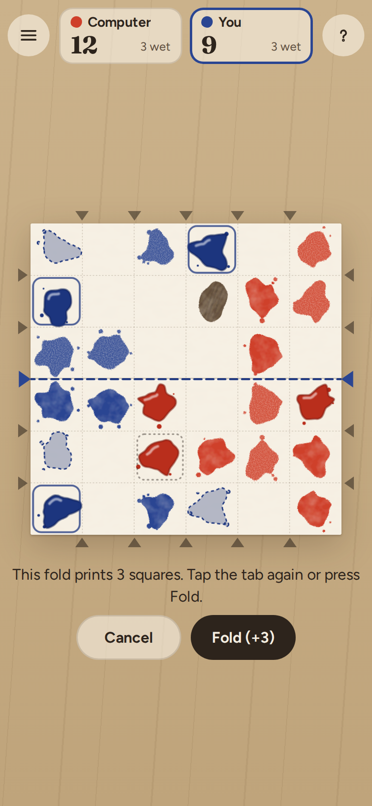
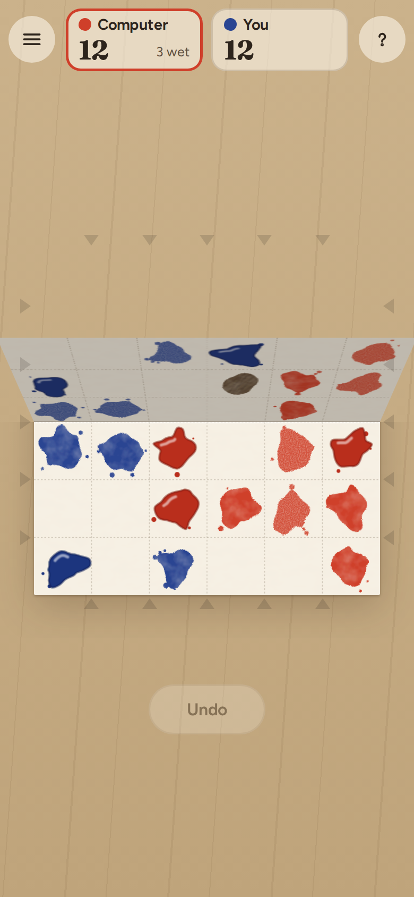

# Blot

**Play it: [junkdrawer.works/blot](https://junkdrawer.works/blot/)**

**A two-player game where folding the paper is a move.** You and the other player drop blots of ink on a sheet of graph paper. On your turn you can fold the sheet along a crease instead, and every blot of yours that's still wet prints a mirror copy onto the square facing it, the way a butterfly painting does. Play the computer at three levels, or pass one phone back and forth.

<p align="center">
  
  &nbsp;
  
  &nbsp;
  
</p>

## How it plays

- **Drop a blot.** Tap a blank square to put a blot of your ink on it. It stays wet, and shiny, until you fold.
- **Or fold the paper.** Tap one of the tabs around the edge to pick a crease. The preview outlines your wet blots, shows a ghost of each print, and shades whatever the fold can't reach. Tap the tab again, or press Fold, and the paper folds over and back.
- **What prints.** Each of your wet blots prints onto the square facing it across the crease. Blank paper takes a copy, flipped like a mirror image. The other player's wet ink smears into mud, which belongs to nobody. Dry ink never changes. Then all your ink dries. The other player's ink isn't pressed by your fold, and stays wet.
- **Short folds reach less.** A crease near the edge only reaches as far as the smaller side.
- **Winning.** The game ends when there's no blank paper left. Whoever holds more squares wins. Mud counts for nobody, and a tie goes to Blue, for going second.
- **Why it's a game.** A fold can print several squares in one turn and smear the other ink into mud, and it makes your ink safe. But it costs you a turn, and while your blots sit wet, the other side can fold first and smear them.
- **The computer** searches ahead over every drop and fold, a move or two on Easy and Normal and as far as it can in a second and a half on Hard. Easy and Normal sometimes take a slightly worse move on purpose. It thinks in the background, so the page keeps moving.
- **Undo** takes back your last move (and the computer's reply). Old folds leave creases in the paper.
- No account and no server. The game in progress and your record against the computer stay in your browser. It works offline and installs to a phone's home screen.

## How the rules were settled

Before any of the board was drawn, the computer played itself hundreds of times under different rules (`tools/sim.mjs` is what's left of that). Folds that pressed both players' ink ended nearly every game in a draw. When wet ink could be printed over after it dried, nobody folded until the paper was full. Making dry ink permanent, and letting only the folder's ink print, gave games where folds come every few turns and the stronger player wins. Red, moving first, still won most games. Giving Blue a whole point overcorrected (32 games between two Hard computers: Red 4, Blue 14, 14 draws), so instead Blue wins ties, and there are no draws. With that rule, 32 games between two Hard computers went 18 to 14 for Red, and 60 between two Normal ones went 40 to 20. Red still has an edge, and it shrinks the better both sides play.

## Running it

It's a static site: plain HTML, CSS and JavaScript modules, with no build step.

```sh
npx serve .                   # or any static file server, then open the printed address
npm install                   # only for the tools below: esbuild and upng-js
npm test                      # the rules and the computer (Node 20+), then the real page in Chromium (needs Playwright)
node tools/sim.mjs 20 6 hard normal   # the computer against itself: games, size, Red's level, Blue's level
node tools/screenshots.mjs    # redraws docs/*.png and og.png
node tools/make-icons.mjs     # redraws the PNG icons from icon.svg
npm run build                 # dist/blot.html, the whole game in one file
```

Opening `index.html` straight from disk won't work, because browsers block JavaScript modules on `file://`. The built file does work that way.

To put it online with GitHub Pages: **Settings → Pages → Build and deployment → Deploy from a branch**, then pick `main` and `/ (root)`.

### Files

- `js/rules.js`: the rules, as plain functions from one position to the next.
- `js/ai.js`: the computer player, an alpha-beta search that deepens until its time runs out. `js/worker.js` runs it off the page.
- `js/blots.js`: the ink splat shapes, drawn from a seed so a print can be the exact mirror of its blot.
- `js/board.js`: the paper: drawing the ink, the tabs, the fold preview, and the fold itself (the flap is a copy of that half of the sheet, turned over in 3D).
- `js/app.js`: the page: the menu, turns, the computer's moves, undo, saving and the result.
- `js/demos.js`: the moving examples in How to play. `js/logo.js`: the butterfly print on the menu.
- `fonts/`: Fraunces and Figtree (SIL Open Font License), served from here so nothing loads from elsewhere.
- `sw.js`: keeps a copy for playing offline. `npm test` checks that it lists every file the page needs.
- `tools/`: the screenshot, icon and simulation scripts. `scripts/build.mjs`: the single-file build.
